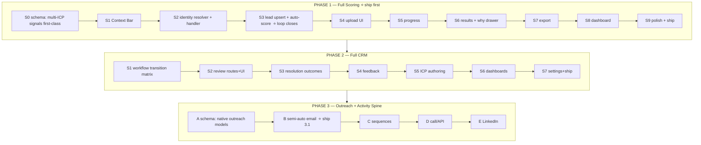

# TeleStar SDR OS V2 — Master Map & Ship Readiness (Overview)

> One-page bird's-eye view of the whole build (Phase 1 + 2 + 3), the document set, the dependency chain,
> ship checkpoints, and the remaining blindspots for design / audit / QA-QC before shipping.
> This is the index; the detailed specs live in the linked docs.

---

## 1. The product in one paragraph
A multi-tenant SDR/lead-gen OS for a BPO. The unit is **LeadAssignment = Company × Project × ICPVersion**, so the
same company scores differently per client/ICP. Everything (qualification, review, activity, outreach) hangs off
LeadAssignment. Build qualify-core first, then CRM, then outreach. Off-the-shelf CRMs can't model this; the native
format is LeadAssignment-centric, project-scoped, ICP-versioned.

---

## 2. The three phases at a glance

**Discipline carried through all phases:** LeadAssignment is the unit · qualification ≠ workflow · assessments
immutable · every session SEE-IT paired (planning gates exempt) · one prompt per session · refresh state +
human review gate between · outreach parked until qualify+CRM ship · Ship-Definition / Parking-Lot to stop scope creep.

---

## 3. Document set (what to open when)

| Doc | Use it when |
|-----|-------------|
| `V2_SCORING_CRM_ACTION_MAP_V1_1_1.md` | the approved planning source-of-truth (order + rules + verified facts) |
| `V2_PHASE1_EXECUTION_LOGIC_SPEC.md` | writing/reviewing Phase 1 code (why + code logic + agent guardrails + diagrams) |
| `V2_PHASE1_CODEX_PROMPT_PACK.md` | running Phase 1 sessions in Codex (one prompt each) |
| `V2_PHASE2_EXECUTION_LOGIC_AND_PROMPTS.md` | Phase 2 logic + prompts (verified: matrix, MR helpers, _LATER gap) |
| `V2_PHASE3_EXECUTION_LOGIC_AND_PROMPTS.md` | Phase 3 logic + prompts (greenfield except suppression schema) |
| `V2_PHASE3_OUTREACH_PLAN.md` | the native outreach data-model rationale (why not off-the-shelf CRM) |
| `V2_UIUX_DESIGN_SPEC_FULL.md` | feeding the ui-ux-pro-max skill: MASTER + ~26 per-screen specs, all phases |
| `V2_BUILD_ROADMAP_phase1_scoring_phase2_crm.md` | the original narrative roadmap (superseded by the action map for ordering) |

**Start here:** action map → Phase 1 logic spec → Phase 1 prompt pack → run **P1.S0A**.

---

## 4. Ship checkpoints
- **Ship 1** = qualify core (upload→identity→lead→score→results→review-read→export). Usable product.
- **Ship 2** = full CRM (workflow matrix, review resolution, feedback, ICP authoring, dashboards).
- **Ship 3.1 / 3.2 / 3.3** = semi-auto email / sequences / call+LinkedIn. Each independently shippable.

---

## 5. BLINDSPOTS before shipping (grounded in the repo, not theory)

### 5A. QA / QC — the biggest gap (verified)
- **Zero tests. No test runner. No CI.** Confirmed: 0 `*.test.ts`/`*.spec.ts`, no vitest/jest in package.json, no
  `.github/workflows`. For AI-generated code this is the #1 risk: every session can silently regress a prior one.
  → **Add a test runner + the first tests in P1.S2A** (the pure identity resolver is the perfect place to start),
  and a minimal CI that runs lint+typecheck+build+test on every change. Treat "fixtures pass" as real tests, not prose.
- **No regression safety net.** Without tests, S6 can break S3 and nobody knows. → Each backend session must add at
  least the unit/integration test for the behavior it introduces (idempotency, tenant isolation, transition matrix,
  suppression gate). Make "tests added" part of every EXIT gate.
- **No integration test for the pipeline.** The loop (upload→identity→upsert→score) needs one end-to-end test on a
  fixture file proving: N rows in → correct lead count, zero duplicates on re-run, ambiguous→review item.
- **No staging / pre-prod + rollback rehearsal.** V0.7 had a "local 50-user stress test" + "rollback rehearsal";
  these got dropped from V0.8+. → Re-add: a 20k-row stress seed run + a migration rollback rehearsal before each
  schema ship.
- **Error-path QA missing.** Define expected behavior for malformed CSV, wrong encoding, huge files, partial
  job failure mid-batch, provider/API timeout. These are day-one realities, not edge cases.

### 5B. Security QA (mostly future-phase, but plan now)
- **Webhook authenticity (P3.B6):** an email-event webhook with no signature check lets anyone POST a fake bounce
  and suppress a real lead. → Verify provider signatures; reject unsigned events. (Guardrail to add to P3.B6.)
- **Credential handling (P3.B2):** sender creds must be encrypted at rest, never logged, honor revoked status.
- **Upload/send rate limiting + file-type/size validation** on the new V2 endpoints (abuse + DoS surface).
- **No middleware boundary between V1 and V2** (only `proxy.ts`). A V2 auth session could reach V1 routes. The old
  audit flagged this. → Add a route boundary so V2 sessions can't hit V1 handlers (and vice-versa).

### 5C. Data correctness blindspots (verified / likely)
- **Tenant-isolation proof.** orgId scoping is the #1 enterprise risk; right now it's assumed, not proven. → Add a
  cross-tenant leak test (seed two orgs, assert org A never sees org B in every read model).
- **Soft-delete filtering is partial.** The lead read model DOES filter `deletedAt IS NULL` (good) — but confirm
  EVERY query (review queue, dashboards, exports, activity) filters it too, or deleted records resurface.
- **Vietnamese / Unicode normalization for identity matching.** `normalizeInput.ts` normalizes, but company names
  with Vietnamese diacritics, "Công ty TNHH/CP" prefixes, and casing will wreck exact-name matching if not handled.
  → The P1.S2A resolver needs explicit Unicode (NFC/NFD) + diacritic + legal-suffix normalization, with VN fixtures.
- **Backfill safety (P1.S0B).** Adding `accountPreRank` to historical assessments by "re-deriving" re-runs ICP1R
  against stored input snapshots — only safe if that is deterministic and the stored snapshot is complete. → Decide:
  backfill via re-derive (test determinism) vs leave historical rows null + document. Don't silently re-score.
- **`latestHardRuleAssessmentId` atomicity.** Re-scoring inserts a new assessment AND moves the pointer — must be
  one transaction, or a crash leaves a stale pointer.
- **Idempotency key collisions.** Re-uploading the same file should be idempotent; a different file with the same
  name should NOT collide. Confirm the key derivation (content hash, not filename).

### 5D. Ops / runtime blindspots
- **Worker deployment is undecided.** The job engine is DB-polling via `process-v2-jobs.mjs` (a CLI). Who runs it
  in production, how many workers, what happens to stuck/orphaned jobs (lease timeout, dead-letter)? → Decide before
  INGEST/SCORE go to real volume. `FOR UPDATE SKIP LOCKED` supports multiple workers; the deployment doesn't exist yet.
- **No observability.** No plan for job-failure alerts, stuck-job detection, send-failure dashboards. → Minimal:
  a jobs admin view (queued/running/failed/retrying) + alerting on failure spikes.
- **Audit-log volume.** Bulk operations writing one audit row per record will explode the table (V0.8 flagged this).
  → Parent audit event + JSON summary per bulk job, not per row.

### 5E. Design / product blindspots
- **The mock is V1-era** (`UI_UX_FLOW.md`/`APP_SKELETON.md`): single-tenant, "company-first", live "Uncertain", no
  Project/ICP context. Building UI from it would omit the core differentiator. → Upgrade the mock to include the
  Context Bar and remove "Uncertain" first (already captured in the UI/UX spec, repeated here because it's easy to forget).
- **Acceptance criteria are thin.** "Scoring agreement ≥70%" is one metric. → Add explicit pass bars: zero dup leads
  on re-run, zero cross-tenant leak, suppression never bypassed, every screen has 4 states, p95 list-load under target at 20k.
- **Activity-recap timezone/"daily" semantics.** "Daily recap" needs a defined tenant timezone; otherwise day
  boundaries drift. Relevant when the activity spine (P3) lands.

---

## 6. The one move that closes most QA blindspots
Add a test runner + CI now, and make **"tests for this behavior + states present + tenant-isolation respected"**
part of every session's EXIT gate. With AI-written code and no tests, you are flying blind between sessions; with a
green test suite per session, each SEE-IT is also a *proven* SEE-IT. This is the single highest-leverage addition
to the plan — fold it into P1.S2A and keep it running.

---

## 7. Status
Planning is complete and review-reconciled. Next real action is unchanged: **run P1.S0A** (planning gate) →
human-approve the diff → P1.S0B. Carry the §5 blindspots in as acceptance/EXIT-gate requirements, especially §5A (tests/CI).
