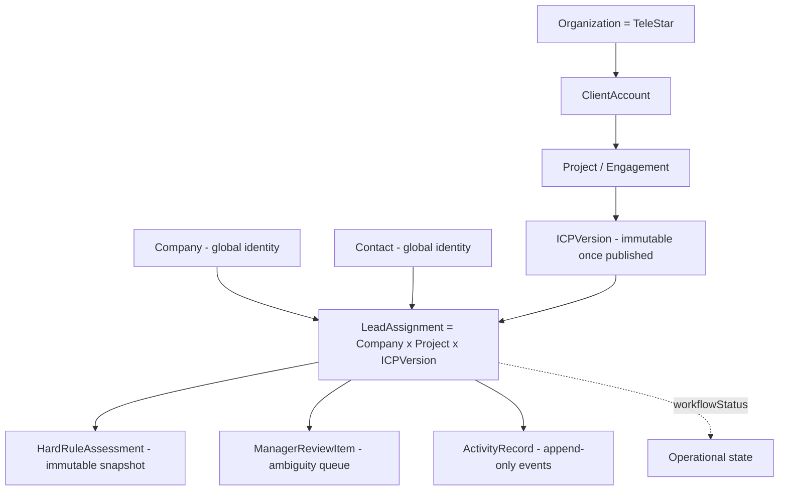
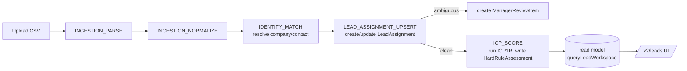
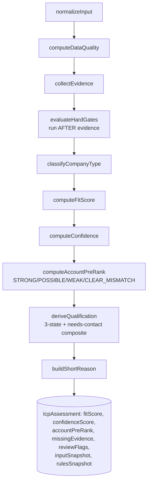

# V2 Phase 1 — Execution & Logic Spec (coding + product logic + diagrams)

> Companion to `V2_SCORING_CRM_ACTION_MAP_V1_1_1.md`. The action map says *what order*;
> this says *why each step exists*, *what the code actually does*, and *how to instruct the agent*
> so the output matches the tool's logic. Planning doc — not a Codex prompt.

---

## PART A — Product logic the agent must always hold

### A1. The one invariant: the unit of work is `LeadAssignment`, not Company

A company is never globally qualified. It is qualified **for a (Project, ICPVersion)**. The same company can be
QUALIFIED for Project A/ICP-v1 and UNQUALIFIED for Project B/ICP-v2 at the same time. Everything — score, review,
activity, later outreach — attaches to `LeadAssignment`, never to `Company`.



### A2. Two state axes that must never be merged

- **Qualification** (lives on `HardRuleAssessment`): QUALIFIED / NEEDS_REVIEW / UNQUALIFIED /
  COMPANY_QUALIFIED_NEEDS_CONTACT. "How well does it fit the ICP."
- **workflowStatus** (lives on `LeadAssignment`): new / assigned / working / contacted / responded / ... .
  "What is operationally happening." A QUALIFIED lead can be `bounced`. Never collapse these.

### A3. The qualify pipeline (the loop Phase 1 must close)


Today PARSE, NORMALIZE, ICP_SCORE are real; **IDENTITY_MATCH and LEAD_ASSIGNMENT_UPSERT are stubs**, so the
chain breaks at `N`. Phase 1's spine (S2B+S3) is exactly closing `N → I → UP → SC`.

### A4. The scoring brain (ICP1R) — verified function order

`assessCompanyAgainstIcp()` runs a fixed pipeline. Each stage has one job; the agent must not reorder it
(evidence is collected BEFORE hard gates — a V1 false-negative bug this design fixes).



Key truth for S0: `accountPreRank` + `missingEvidence` are what encode "company fits but needs contact."
Today they live only inside JSON. S0 promotes them so the UI/filters can use them.

---

## PART B — How to shape the agent (methodology, applies to every session)

### B1. Contract-first
Before any implementation session, the types are frozen. The agent writes/edits **types** first, gets review,
then implements against them. This is why S0A (plan) and S2A (pure module) precede their handlers.

### B2. Tool-logic guardrails the agent must obey (put these in EVERY prompt)
1. **Immutability:** never UPDATE a `HardRuleAssessment`; always INSERT a new one + move
   `LeadAssignment.latestHardRuleAssessmentId`.
2. **Idempotency:** every job uses `idempotencyKey`; re-running must not duplicate leads/assessments/reviews.
3. **Tenant scope:** every query/insert is filtered by `organizationId`; never trust a client-supplied org.
4. **Snapshot-on-write:** scoring writes full `inputSnapshot` + `rulesSnapshot` so the assessment is replayable.
5. **No V1 touch:** never edit `lib/server/**`, `app/api/**` (V1), or V1 Prisma models.
6. **Resolver reuse:** identity logic must be usable by company upload AND activity recap AND LinkedIn later.
7. **No fake rows:** never create placeholder `HardRuleAssessment` just to show a state (NOT_SCORED is derived).

### B3. The prompt skeleton (every implementation session)
```
CONTEXT: phase id, the ONE invariant in play, the verified facts it depends on.
GOAL: one sentence, one outcome.
ALLOWED FILES: explicit list (narrow).
FORBIDDEN: V1 paths, schema (unless schema session), UI (unless UI session), other job types.
GUARDRAILS: the relevant items from B2.
VERIFICATION: prisma validate / lint / typecheck / build / the specific runtime check.
SEE-IT: what becomes visible in the browser (or "planning gate, exempt").
EXIT: append SESSION_LOG; stop; human review.
```

### B4. Why "one change-kind per session"
Mixing migration + runtime + UI in one diff hides logic errors behind a green build. Schema+read-model may
travel together (a column with nothing reading it is dead); UI is always the next, separate session.

---

## PART C — Per-session detail (Phase 1)

> Format per session: **WHY** (product logic) · **CODE LOGIC** (data/functions) · **AGENT GUIDELINE**
> (instruction + session-specific guardrail) · **SEE-IT**.

### P1.S0A — Qualification/assessment schema audit (planning gate)
- **WHY:** the multi-ICP signals (`accountPreRank`, `missingEvidence`) are buried in JSON, so the product's
  core distinction can't be queried/filtered. Before changing schema we lock the exact diff so the agent
  doesn't guess names.
- **CODE LOGIC:** produce a written diff only — exact enum value `COMPANY_QUALIFIED_NEEDS_CONTACT`, new column
  `accountPreRank` (enum, indexed), mapper change points in `mapIcpAssessmentToPersistence.ts`, read-model
  change points, and the decision that **`NOT_SCORED` is read-model-derived when `latestHardRuleAssessmentId IS NULL`**.
- **AGENT GUIDELINE:** read-only; output a diff table; confirm the 3 open items (CORE1 index names, UNCERTAIN
  deprecate-vs-drop, `createReviewItem` signature). Forbid any edit. Forbid adding NOT_SCORED to the DB enum.
- **SEE-IT:** none (planning gate, exempt per R1).

### P1.S0B — Schema + mapper + read-model patch (backend half)
- **WHY:** make the multi-ICP distinction a first-class, queryable fact.
- **CODE LOGIC:** migration adds `accountPreRank` column + index and the new qualification enum value;
  `mapIcpAssessmentToPersistence` writes `accountPreRank` to the column and emits
  `COMPANY_QUALIFIED_NEEDS_CONTACT` when `accountPreRank=STRONG_ACCOUNT_FIT && qualification=NEEDS_REVIEW &&
  missingEvidence.length>0`; `queryLeadWorkspace` selects the column and derives `NOT_SCORED` on null assessment;
  remove the `null→UNCERTAIN` coercion in `queryReviewQueue.ts`.
- **AGENT GUIDELINE:** schema+read-model only, no UI. Guardrails: immutability (don't rewrite historical rows —
  backfill via re-derive or leave + note), tenant scope, no V1. Verify `prisma validate` + a unit assertion that
  a STRONG+needs-evidence fixture maps to the 4th value.
- **SEE-IT:** none yet — paired; surfaced in S0C (no macro-phase may start before S0C).

### P1.S0C — Leads UI semantic patch (SEE-IT half)
- **WHY:** the existing screen currently lies (shows ghost UNCERTAIN). Make it tell the truth.
- **CODE LOGIC:** `statusBadges` + `AssessmentSummaryCard` + `LeadWorkspaceFilters` render the 4th state and
  `accountPreRank` band; `NOT_SCORED` gets a distinct neutral style; remove UNCERTAIN branches.
- **AGENT GUIDELINE:** UI only; compose from existing components; no schema/runtime; tokens only (no raw hex).
- **SEE-IT:** `/v2/leads` (seeded data) shows "Company qualified – needs contact" + pre-rank; no fake UNCERTAIN.

### P1.S1 — Tokens + AppShell + Context Bar
- **WHY:** the Context Bar (Account→Project→ICP) is the only thing that makes the UI *multi-ICP* rather than a
  prettier company table. It is the product's spine made visible.
- **CODE LOGIC:** a read fn lists accounts→projects→ICP versions for the tenant; ContextBar stores selection in
  URL search params; every workspace query reads those params.
- **AGENT GUIDELINE:** lock semantic status tokens in `globals.css @theme` first (these become the only allowed
  status colors); build ContextBar as a shell element; UI + one read fn only.
- **SEE-IT:** switching context in the top bar refilters `/v2/leads` live.

### P1.S2A — Identity resolver (pure-runtime module + fixtures)
- **WHY:** identity matching is the highest-risk logic (duplicate leads / false merges / tenant leaks). It is
  built pure first so it can be tested exhaustively with no DB risk, and reused by activity/LinkedIn later.
- **CODE LOGIC:** a pure module: input = normalized row + tenant/project context; output = one of
  `exact_company` / `exact_contact` / `candidate` (fuzzy) / `none`. Order: canonical-domain exact →
  normalized-name within account/project → fuzzy = candidate only → none. No Prisma, no DB, no handler.
- **AGENT GUIDELINE:** pure TS + fixtures (mirror the A1 activity resolver pattern). Guardrail B2.6 (reusable).
  Forbid Prisma/DB/handler. Verify fixtures pass.
- **SEE-IT:** none yet — paired with S2B.

### P1.S2B — IDENTITY_MATCH handler + ingestion viewer
- **WHY:** wire the pure resolver into the pipeline and *show* it, so matching is observable before it creates leads.
- **CODE LOGIC:** `IDENTITY_MATCH` handler reads `V2IngestionRow`s, calls the S2A module, writes
  `matchedCompanyId`/`matchedContactId`, sets row status (`MATCHED` / ambiguous→still needs review / `ERROR`);
  NORMALIZE now enqueues IDENTITY_MATCH; a dev "Run seeded ingestion" button triggers it.
- **AGENT GUIDELINE:** runtime + minimal UI; idempotency + tenant guardrails; register handler in
  `lib/v2/jobs/handlers.ts`. Verify a seeded job marks rows correctly.
- **SEE-IT:** `/v2/ingestion/[jobId]` shows rows matched/ambiguous/none (button-triggered, per R2).

### P1.S3 — LEAD_ASSIGNMENT_UPSERT + score enqueue ⭐ loop closes
- **WHY:** this is the milestone — uploads become real, scored leads. Also where duplicate-prevention logic
  (company-level vs contact-level, nullable contact) lives, enforced by CORE1 partial unique indexes.
- **CODE LOGIC:** `LEAD_ASSIGNMENT_UPSERT` decides level (no contact → company-level; contact → contact-level),
  idempotent upsert against the partial unique indexes; ambiguous/fuzzy rows call `createReviewItem` (read-only
  producer); on clean upsert, auto-enqueue `ICP_SCORE` via `enqueueScoringJobs`.
- **AGENT GUIDELINE:** runtime only + small lineage link in UI. Guardrails: idempotency (re-run = no dup leads),
  immutability (scoring still inserts new assessment), tenant scope. Verify: seeded upload populates leads;
  re-run creates zero duplicates; ambiguous row creates exactly one review item.
- **SEE-IT:** seeded pipeline populates `/v2/leads`, auto-scored.

### P1.S4 — Upload + mapping API/UI (real browser loop)
- **WHY:** replace the seed button with a real user flow; this is the "product runs from the browser" moment.
- **CODE LOGIC:** `POST /v2/ingestion` (create job + file intake) → enqueue PARSE; `POST .../mapping`
  (save `mappingJson`, validate required headers) → enqueue NORMALIZE; `GET .../status`. Mapping UI uses
  papaparse to preview headers, react-hook-form for the mapping form.
- **AGENT GUIDELINE:** API + UI; `requirePermission("ingestion.apply")`; tenant from session (not query param);
  no scoring/identity changes. Verify upload→map→run from browser.
- **SEE-IT:** real CSV upload → column mapping → run, no seed script.

### P1.S5 — Scoring progress UI
- **WHY:** at volume, scoring is async; the user needs to watch it and trust it.
- **CODE LOGIC:** `GET .../progress` aggregates the ingestion job + child `V2Job`s (progressCurrent/Total/status);
  UI polls every 2–3s; shows counts per qualification incl. derived NOT_SCORED.
- **AGENT GUIDELINE:** read API + UI; no mutation; reuse `ui/progress`. Verify live counts on a real run.
- **SEE-IT:** live progress + counts on `/v2/ingestion/[jobId]`.

### P1.S6 — Results table + "why" drawer (mock parity)
- **WHY:** this is the screen that sells the product; the drawer must *explain* the score and *prove* multi-ICP.
- **CODE LOGIC:** read model exposes `accountPreRank`/`missingEvidence` (columns from S0B) + a
  same-company-across-other-ICP query; table uses TanStack (sort/filter/virtualize 20k); drawer renders
  reason + hard-rule flags + matched/missed + evidence + raw input snapshot + multi-ICP cross-view.
- **AGENT GUIDELINE:** UI + read-model only; tokens only; 4 states. Verify on 20k seed for perf.
- **SEE-IT:** results screen at mock parity; drawer explains "why" per ICP.

### P1.S7 — Async export
- **WHY:** the team must *act* on the qualified list; export is the minimal handoff. Project-scoped, never a global dump.
- **CODE LOGIC:** `EXPORT_GENERATE` handler builds CSV (scope: full / qualified-only / needs-contact) → stores →
  signed URL; `POST /v2/exports` + `GET /v2/exports/[id]`.
- **AGENT GUIDELINE:** runtime + UI; job-based (no sync CSV build); tenant + project scoped. Verify a job exports
  the filtered set.
- **SEE-IT:** one-click export.

### P1.S8 — Dashboard / Home
- **WHY:** a landing view that summarizes the qualify pipeline per context.
- **CODE LOGIC:** context-scoped aggregate counts (qualified/needs_review/unqualified/needs_contact/derived
  not_scored) + recent ingestion jobs.
- **AGENT GUIDELINE:** read-model + UI; reuse MetricCard; charts via simple SVG (recharts not installed — decide).
- **SEE-IT:** `/v2/home` dashboard.

### P1.S9 — Styling pass + states audit + acceptance (ship)
- **WHY:** match the mock; guarantee every screen survives loading/error/empty; prove correctness at volume.
- **CODE LOGIC:** restyle via tokens; ensure 4 states everywhere; correctness/tenant/idempotency audit on 20k seed.
- **AGENT GUIDELINE:** UI polish + audit; no new features. Acceptance = scoring agreement ≥70%.
- **SEE-IT:** the whole Phase-1 product, shipped.

---

## One-line
Hold the invariant (LeadAssignment is the unit; qualification ≠ workflow; assessment immutable), close
`normalize → identity → upsert → score` (S2B+S3), surface every step, and instruct the agent with contract-first
+ the 7 guardrails. The diagrams above are the mental model the agent must never violate.
