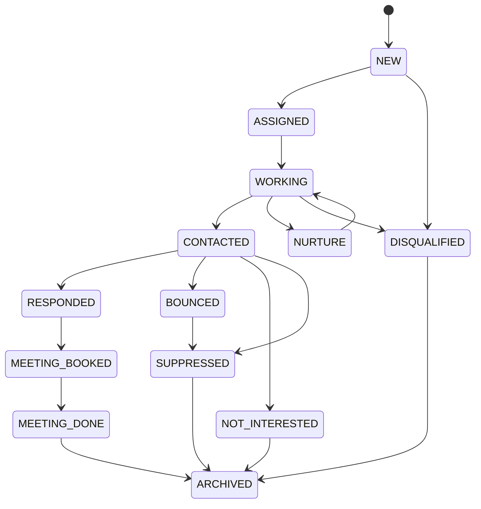
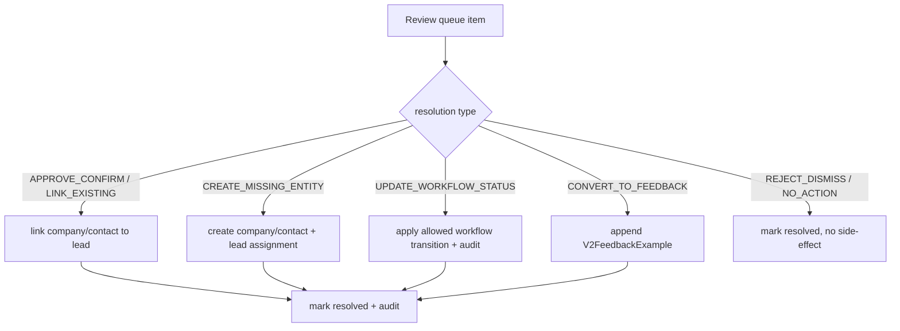

# V2 Phase 2 (Full CRM) — Execution Logic Spec + Codex Prompt Pack

> Companion to `V2_PHASE1_EXECUTION_LOGIC_SPEC.md` (same format) and the action map.
> Grounded in the ACTUAL repo (verified, not guessed). Planning doc — run prompts one at a time, refresh
> against state, only after the prior review gate.
>
> **Verified Phase-2 reality (so we build the real gaps, not duplicates):**
> - `V2LeadWorkflowStatus` enum = NEW, ASSIGNED, WORKING, CONTACTED, RESPONDED, MEETING_BOOKED, MEETING_DONE,
>   NURTURE, NOT_INTERESTED, BOUNCED, SUPPRESSED, DISQUALIFIED, ARCHIVED. `updateLeadWorkflowStatus` exists,
>   audits via `recordAuditEvent`, but has **NO transition matrix** (any→any).
> - Manager-review lifecycle helpers **ALL exist** in `lib/v2/manager-review/`: createReviewItem, startReviewItem,
>   assignReviewItem, resolveReviewItem, rejectOrIgnoreReviewItem, snoozeReviewItem, queryReviewQueue, queryReviewItem.
> - `V2ManagerReviewResolutionType` = APPROVE_CONFIRM, REJECT_DISMISS, REQUEST_CHANGES, LINK_EXISTING,
>   **CREATE_MISSING_ENTITY_LATER, CONVERT_TO_FEEDBACK_LATER, UPDATE_WORKFLOW_STATUS_LATER**, NO_ACTION_NON_ACTIONABLE.
>   The `_LATER` values prove resolve **records the decision but does NOT execute the side-effects yet** → that's S3.
> - `V2FeedbackExample` (organizationId, leadAssignmentId, correctionJson) and `V2ICPVersion`
>   (status DRAFT/published, publishedAt, OCC `version`) **already exist in schema.**
> - V2 review routes = read-only page only (`app/v2/reviews/page.tsx`); no action routes yet.
> - `V2ActivityRecord` does NOT exist → **activity spine is Phase 3**, not Phase 2 (V1 standalone recap covers interim).

Phase 2 = 7 sessions: S1 transition matrix · S2 review routes+UI · S3 resolution outcomes · S4 feedback ·
S5 ICP authoring · S6 dashboards · S7 settings/ship.

---

## PART A — Product logic the agent must hold (CRM)

### A1. Two state axes — now with a transition machine
Qualification (immutable, on HardRuleAssessment) ≠ workflowStatus (mutable, on LeadAssignment). In Phase 2 the
mutable axis gets a **state machine**: not every status can follow every other. A QUALIFIED lead can become
`bounced` or `not_interested`; those are workflow facts, not re-scoring.


(Exact edges are a **business decision** — confirm with the team; the diagram is a sane default to refine.)

### A2. Review is the human-in-the-loop OVERLAY, not a mutation of truth
A ManagerReviewItem is a decision queue. Resolving it must **create/link/update real records or feedback** —
but must NEVER mutate a historical HardRuleAssessment. The `_LATER` resolution types today only record intent;
S3 makes them execute.



### A3. Feedback is append-only tuning evidence — never auto-applies to rules
`V2FeedbackExample` is evidence. It informs future human rule changes; it must never silently change an ICP
version or re-score. ICP rule changes go only through ICP authoring (A4).

### A4. ICP versions are immutable once published
Editing a published ICP creates a NEW version (versionNumber + OCC `version`). Concurrent edits are rejected by
optimistic concurrency. Published versions are never edited in place — this protects assessment reproducibility.

---

## PART B — Phase-2 agent guardrails (add to the 7 base guardrails)
8. **Transitions validated by matrix:** workflowStatus changes go through the matrix; invalid edge → reject + clear error.
9. **Resolution executes idempotently:** a review resolution side-effect runs exactly once; re-resolve is a no-op.
10. **Feedback append-only:** writing feedback never mutates ICP rules or assessments.
11. **ICP publish = new version + OCC:** never edit a published version in place; reject stale-version saves.
12. **Audit every mutation:** reuse `recordAuditEvent`; review/workflow/feedback/publish all leave an audit trail.
13. **Reuse, don't rebuild:** call existing MR2 helpers + the P1.S2A identity resolver; do not write parallel logic.

---

## PART C — Per-session detail

### P2.S1 — Workflow transition matrix (backend) + status control (SEE-IT)
- **WHY:** any→any lets SDRs set illegal states (e.g. NEW→MEETING_DONE), corrupting pipeline reporting later.
- **CODE LOGIC:** new `lib/v2/workflow/transitionMatrix.ts` (Record<status, status[]>); `updateLeadWorkflowStatus`
  checks the matrix before writing, rejects invalid with a stable error code; keeps `recordAuditEvent`.
  Drawer status control renders only allowed next states.
- **AGENT GUIDELINE:** backend + the drawer control; guardrails 8 + 12; do not touch qualification.
- **SEE-IT:** drawer offers only valid next statuses; illegal change rejected with a message.

### P2.S2 — Manager Review routes + interactive UI (SEE-IT)
- **WHY:** all lifecycle helpers exist but the queue is read-only; expose them so reviews can actually be worked.
- **CODE LOGIC:** routes under `app/v2/reviews/**/route.ts` wrapping start/assign/resolve/reject/snooze
  (behind `requirePermission("manager_review.decide")`); `/v2/reviews` gets detail panel + action buttons + bulk select.
- **AGENT GUIDELINE:** routes + UI only; call existing MR2 helpers (don't reimplement); guardrails 9 + 12.
- **SEE-IT:** assign + resolve an item from the queue; status updates live.

### P2.S3 — Resolution OUTCOME execution (the `_LATER` gap)
- **WHY:** resolve currently records a resolutionType but the `_LATER` outcomes (create entity, convert to
  feedback, update workflow) are not executed. This makes resolution real.
- **CODE LOGIC:** in the resolve path (route/service), branch on resolutionType: LINK_EXISTING/APPROVE_CONFIRM →
  link company/contact to the lead; CREATE_MISSING_ENTITY → create company/contact + lead assignment (reuse the
  identity resolver + upsert logic from P1); UPDATE_WORKFLOW_STATUS → apply an allowed transition (matrix from S1);
  CONVERT_TO_FEEDBACK → append `V2FeedbackExample`; REJECT/NO_ACTION → mark resolved only. All inside the resolve
  transaction; never mutate historical assessments.
- **AGENT GUIDELINE:** backend; guardrails 9, 10, 12, 13. Verify each branch produces its record change exactly once.
- **SEE-IT:** resolving with each action visibly creates/links/updates the lead.

### P2.S4 — Feedback capture + history
- **WHY:** capture SDR/manager corrections as append-only evidence; visible history.
- **CODE LOGIC:** `lib/v2/feedback/appendFeedback.ts` writes `V2FeedbackExample` (org, leadAssignmentId,
  correctionJson, provenance); feedback control in the lead drawer; read-only `/v2/feedback` history.
- **AGENT GUIDELINE:** backend + UI; guardrail 10 (never auto-applies); audit.
- **SEE-IT:** a correction appends one record; history list shows it.

### P2.S5 — ICP authoring (editor / publish / OCC)
- **WHY:** managers must author + publish ICP versions; schema (status, versionNumber, OCC `version`) already exists.
- **CODE LOGIC:** ICP editor (rules form via react-hook-form + zod) on `/v2/icp-library`; save respects OCC
  `version` (reject stale); publish transitions DRAFT→published + sets publishedAt + creates a new versionNumber;
  published versions are read-only.
- **AGENT GUIDELINE:** backend + UI; guardrail 11; never edit published in place.
- **SEE-IT:** author a draft, publish it, see a new immutable version; concurrent edit rejected.

### P2.S6 — CRM dashboards + reporting
- **WHY:** management overview of pipeline + productivity, context-scoped.
- **CODE LOGIC:** read-model aggregates: leads by workflowStatus, qualification mix, SDR activity counts,
  trends; all scoped by the Context Bar (account/project/ICP).
- **AGENT GUIDELINE:** read-model + UI; no mutation; reuse MetricCard; confirm chart dep (no recharts installed).
- **SEE-IT:** a manager dashboard whose numbers reconcile with the leads/review data.

### P2.S7 — Settings, org selector, RBAC polish, styling, acceptance (SHIP)
- **WHY:** finish CRM; users in >1 org need to switch; every mutation must be permission-checked.
- **CODE LOGIC:** org selector in shell; settings page; audit RBAC on every Phase-2 mutation route; 4-state pass;
  styling to the design system; run on stress seed.
- **AGENT GUIDELINE:** no new features; no outreach/send anything.
- **SEE-IT:** full CRM shipped (pre-outreach).

---

## PART D — Codex Prompt Pack (Phase 2)

> Standing rules + **[VERIFY-CODE]** = same as the Phase 1 pack. One prompt per session; refresh against state;
> run only after the prior review gate; append `docs/v2/codex/SESSION_LOG.md`; stop for review.

### P2.S1
```
CONTEXT: P2.S1. V2LeadWorkflowStatus has 13 values; updateLeadWorkflowStatus audits but allows any→any.
Qualification is separate and untouched here.
GOAL: Add a workflow transition matrix; enforce it; surface valid-only status controls.
ALLOWED: new lib/v2/workflow/transitionMatrix.ts; lib/v2/crm/updateLeadWorkflowStatus.ts;
app/v2/leads/[leadAssignmentId]/workflow/route.ts; status control in components/v2/leads/**.
FORBIDDEN: qualification/scoring logic; schema; V1 (lib/server/**, app/api/**).
DO: matrix Record<V2LeadWorkflowStatus, V2LeadWorkflowStatus[]> (use the spec's default, mark it adjustable);
updateLeadWorkflowStatus rejects invalid transitions with a stable error code, keeps recordAuditEvent; drawer
renders only allowed next states.
GUARDRAILS: requirePermission("workflow.update"); tenant-scoped; audit each change.
VERIFICATION: [VERIFY-CODE]; NEW→MEETING_DONE rejected; NEW→ASSIGNED writes audit.
SEE-IT: drawer shows valid-only transitions; illegal change errors clearly.
EXIT: append SESSION_LOG; STOP for review.
```

### P2.S2
```
CONTEXT: P2.S2. MR2 lifecycle helpers (start/assign/resolve/reject/snooze/query) already exist; /v2/reviews is
read-only. Producers (P1.S3 ambiguous upserts + scoring NEEDS_REVIEW) feed the queue.
GOAL: Expose review actions as routes + make /v2/reviews interactive (assign/resolve/reject + bulk select).
ALLOWED: new app/v2/reviews/**/route.ts; components/v2/reviews/**; lib/v2/manager-review/** (CALL existing helpers).
FORBIDDEN: reimplementing MR logic; executing resolution side-effects (that is S3); scoring; schema; V1.
DO: routes wrap startReviewItem/assignReviewItem/resolveReviewItem/rejectOrIgnoreReviewItem/snoozeReviewItem
behind requirePermission("manager_review.decide"); queue UI with detail panel + actions + bulk select.
GUARDRAILS: tenant-scoped; idempotent; audit.
VERIFICATION: [VERIFY-CODE]; assign then resolve an item; queue updates.
SEE-IT: a working, resolvable review queue.
EXIT: append SESSION_LOG; STOP for review.
```

### P2.S3
```
CONTEXT: P2.S3. resolveReviewItem records a V2ManagerReviewResolutionType but the _LATER outcomes
(CREATE_MISSING_ENTITY_LATER, CONVERT_TO_FEEDBACK_LATER, UPDATE_WORKFLOW_STATUS_LATER) are NOT executed. Make them real.
GOAL: Execute resolution side-effects idempotently inside the resolve flow; never mutate historical assessments.
ALLOWED: lib/v2/manager-review/resolveReviewItem.ts (or a resolution-effects module it calls); the S2 resolve route;
reuse lib/v2/identity (P1.S2A) + the P1 upsert logic; lib/v2/feedback (if present) ; minimal UI in components/v2/reviews/**.
FORBIDDEN: mutating HardRuleAssessment; scoring logic; V1.
DO: branch on resolutionType — APPROVE_CONFIRM/LINK_EXISTING → link entity to lead; CREATE_MISSING_ENTITY →
create company/contact + lead assignment (reuse resolver+upsert); UPDATE_WORKFLOW_STATUS → apply an allowed
transition (S1 matrix); CONVERT_TO_FEEDBACK → append V2FeedbackExample; REJECT/NO_ACTION → mark resolved only.
All within the resolve transaction.
GUARDRAILS: each side-effect runs exactly once (idempotent); tenant-scoped; audit; never UPDATE assessments.
VERIFICATION: [VERIFY-CODE]; each branch produces its record change exactly once; re-resolve is a no-op.
SEE-IT: resolving with each action visibly creates/links/updates the lead.
EXIT: append SESSION_LOG; STOP for review.
```

### P2.S4
```
CONTEXT: P2.S4. V2FeedbackExample exists (organizationId, leadAssignmentId, correctionJson). Feedback is
append-only tuning evidence; it never auto-applies to ICP rules.
GOAL: Capture SDR/manager corrections + a read-only feedback history.
ALLOWED: new lib/v2/feedback/appendFeedback.ts; feedback control in components/v2/leads/**; new app/v2/feedback/page.tsx.
FORBIDDEN: auto-mutating ICP rules or assessments; scoring; V1.
DO: appendFeedback writes V2FeedbackExample with provenance; drawer control to submit a correction; history list.
GUARDRAILS: append-only; tenant-scoped; audit.
VERIFICATION: [VERIFY-CODE]; a correction appends exactly one record; appears in history.
SEE-IT: corrections logged + visible history.
EXIT: append SESSION_LOG; STOP for review.
```

### P2.S5
```
CONTEXT: P2.S5. V2ICPVersion already has status (DRAFT/published), publishedAt, versionNumber, OCC `version`.
Published versions are immutable; edits create a new version.
GOAL: ICP authoring — draft editor, publish flow, OCC-protected saves.
ALLOWED: lib/v2/icp/**; app/v2/icp-library/** (editor + routes behind a manager permission).
FORBIDDEN: editing published versions in place; scoring logic; V1.
DO: rules editor (react-hook-form + zod); save checks OCC `version` and rejects stale; publish DRAFT→published,
set publishedAt, create new versionNumber; published = read-only.
GUARDRAILS: guardrail 11; tenant-scoped; audit.
VERIFICATION: [VERIFY-CODE]; concurrent edit rejected by OCC; publish yields a new immutable version.
SEE-IT: author a draft, publish, see new version; stale save rejected.
EXIT: append SESSION_LOG; STOP for review.
```

### P2.S6
```
CONTEXT: P2.S6. Management overview, context-scoped (Account/Project/ICP).
GOAL: CRM dashboards — pipeline by workflowStatus, qualification mix, SDR activity, trends.
ALLOWED: lib/v2/dashboard/**; app/v2/reports + manager dashboard; chart components.
FORBIDDEN: mutation; schema; V1.
DO: read-model aggregates scoped by Context Bar; charts (confirm chart dependency — recharts not installed).
GUARDRAILS: requirePermission("crm.read"); tenant-scoped.
VERIFICATION: [VERIFY-CODE]; numbers reconcile with leads/review data for the same context.
SEE-IT: a manager dashboard.
EXIT: append SESSION_LOG; STOP for review.
```

### P2.S7
```
CONTEXT: P2.S7 ships Phase 2.
GOAL: Org selector (users in >1 org), settings, RBAC polish on every mutation route, styling + states audit.
ALLOWED: app/v2/settings; org selector in components/shared shell; styling across app/v2 + components.
FORBIDDEN: any outreach/send runtime; schema; V1.
DO: org switch + settings; verify requirePermission on EVERY Phase-2 mutation route; 4-state audit on all screens;
styling pass to the design system on a stress seed.
VERIFICATION: [VERIFY-CODE]; RBAC enforced on all mutations; all screens have loading/error/empty.
SEE-IT: full CRM, shipped (pre-outreach).
EXIT: append SESSION_LOG with acceptance notes; STOP. Phase 2 ships.
```

---

## One-line
Phase 2 mostly EXPOSES + COMPLETES what already exists: add the missing transition matrix (S1), expose the
existing review helpers (S2), make the `_LATER` resolution outcomes actually execute (S3 — the real gap), wire
the existing FeedbackExample + ICPVersion schemas to UI (S4/S5), then dashboards + ship (S6/S7). Activity spine
stays in Phase 3. Never mutate assessments; never auto-apply feedback; validate every transition; reuse helpers.
