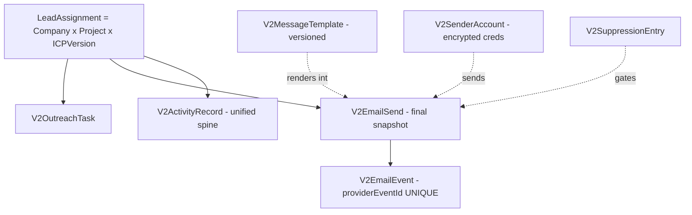
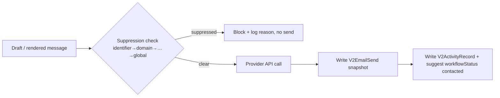

# V2 Phase 3 (Full Outreach + Activity Spine) — Execution Logic Spec + Codex Prompt Pack

> Same format as the Phase 1/2 specs. Grounded in the ACTUAL repo (verified). Planning doc — run prompts one at
> a time, refresh against state, only after the prior review gate. Outreach stays parked until Phase 1+2 ship.
>
> **Verified Phase-3 reality (greenfield except suppression schema):**
> - `V2SuppressionEntry` EXISTS (scopeType, scopeId, identifierType, identifierValueNormalized, suppressionType,
>   reason, source, createdByUserId, expiresAt) — but there is **NO suppression runtime** (`lib/v2` has no
>   suppression check). Suppression-as-a-gate must be BUILT.
> - Job-type enum values exist (stubs): `ACTIVITY_APPLY`, `EMAIL_SEND`, `SEQUENCE_STEP_EXECUTE`.
> - **No models exist** for V2ActivityRecord, V2MessageTemplate, V2SenderAccount, V2OutreachTask, V2EmailSend,
>   V2EmailEvent, V2Sequence*. All must be created.
> - No outreach runtime directory in `lib/v2`.
> - Identity resolver (P1.S2A) exists and MUST be reused for activity/LinkedIn matching.

Phase 3 sub-phases: **A** activity spine + outreach schema · **B** semi-auto email (first ship) · **C** sequences ·
**D** call/API · **E** LinkedIn.

---

## PART A — Product logic the agent must hold (outreach)

### A1. The record is still `LeadAssignment` — outreach is NOT contact/deal-centric
Every outreach/activity object hangs off `leadAssignmentId` (+ `organizationId`). Do not introduce a global
"deal" or company-level outreach record. A "campaign view" is a lens over project/ICP-scoped LeadAssignments.



### A2. Suppression is the LAST synchronous step before EVERY provider call — invariant
No email (manual or sequence) leaves the system without a synchronous suppression check immediately before the
provider API call. Scope order checked: identifier → domain → contact → company → project → org → global.
This is a hard compliance invariant; it is built in B3 and reused everywhere.



### A3. EmailSend stores the FINAL rendered snapshot, never just templateId
finalSubject/finalBody/recipient/sender/variablesSnapshot/suppressionResult/sentAt/provider/providerMessageId.
This protects audit, client reporting, and template-version drift. Templates are versioned; the send freezes what
was actually sent.

### A4. Activity spine: all channels land in one append-only log
`V2ActivityRecord(leadAssignmentId, channel, type, outcome, source, ...)` is the single event log for email
sends, email events, calls, LinkedIn messages, and manual notes. Outcomes may SUGGEST a workflow transition
(through the S1 matrix), never blindly mutate it.

### A5. Semi-auto vs auto
Semi-auto (B) = system drafts/renders/queues; a human approves each send. Auto (C) = sequences executed by JOB0
workers, with stop conditions; suppression gate unchanged. Build semi-auto first; it is independently shippable.

---

## PART B — Phase-3 agent guardrails (add to base + Phase-2 sets)
14. **Suppression gate is non-removable:** every send path calls the synchronous check immediately before the
    provider call; no flag or "fast path" may skip it.
15. **Snapshot-on-send:** every real send writes a full V2EmailSend snapshot; never store only templateId.
16. **Webhook idempotency:** V2EmailEvent unique on providerEventId; duplicate/out-of-order events are no-ops.
17. **Encrypted credentials:** sender creds stored encrypted; never logged; revoked status honored.
18. **Workers, not UI, for sequences:** sequence steps execute via JOB0 (`SEQUENCE_STEP_EXECUTE`), never sync.
19. **Activity append-only + reuse resolver:** ActivityRecord never edited in place; LinkedIn/recap matching reuses
    the P1 identity resolver — no second resolver.
20. **Compliance gate before LinkedIn auto-collection:** P3.E2 (extension scraping) requires ToS + data-protection
    review first; prefer P3.E1 (manual export) which is far lower risk.

---

## PART C — Per-session detail + prompts

> **[VERIFY-CODE]** and standing rules = same as the Phase 1/2 packs. Schema sessions also run prisma
> validate/migrate/generate. One prompt per session; refresh against state; review gate between.

### P3.S0 — Outreach model design (PLANNING GATE)
- **WHY:** outreach is greenfield; lock the native LeadAssignment-scoped model shapes before any migration.
- **CODE LOGIC:** produce the exact field lists for V2ActivityRecord, V2MessageTemplate (versioned),
  V2SenderAccount, V2OutreachTask, V2EmailSend (snapshot fields), V2EmailEvent (providerEventId UNIQUE); confirm
  V2SuppressionEntry shape; decide CORE-now vs deferred.
- **SEE-IT:** none (planning gate).
```
CONTEXT: P3.S0. Outreach is greenfield except V2SuppressionEntry. Record = LeadAssignment. Plan only, no code.
GOAL: Output exact field/index lists for the native outreach models + migration outline + rollback note.
ALLOWED (read only): prisma/schema.prisma; lib/v2/identity/**; lib/v2/jobs/**; append docs/v2/codex/SESSION_LOG.md.
FORBIDDEN: any edit except SESSION_LOG; V1.
PRODUCE: field lists (all organizationId + leadAssignmentId scoped, soft-delete, OCC where config) for
V2ActivityRecord, V2MessageTemplate, V2SenderAccount, V2OutreachTask, V2EmailSend, V2EmailEvent; confirm
V2SuppressionEntry; migration plan; which are CORE-now vs deferred.
VERIFICATION: git status shows only SESSION_LOG.
EXIT: append SESSION_LOG; STOP for human review.
```

### P3.A1 — Outreach + activity-spine schema (BACKEND HALF)
- **WHY:** the foundation everything hangs off.
- **CODE LOGIC:** add the S0-approved models; all leadAssignmentId + organizationId scoped; soft-delete;
  V2EmailEvent.providerEventId UNIQUE; templates/senders versioned.
```
CONTEXT: P3.A1 implements the S0-approved outreach models. Schema only. Record = LeadAssignment.
GOAL: Create V2ActivityRecord, V2MessageTemplate, V2SenderAccount, V2OutreachTask, V2EmailSend, V2EmailEvent.
ALLOWED: prisma/schema.prisma; prisma/migrations/**.
FORBIDDEN: runtime; UI; V1.
DO: all models organizationId + leadAssignmentId scoped (templates/senders org-scoped, optional project);
soft-delete; OCC version on templates; V2EmailEvent unique(providerEventId).
VERIFICATION: prisma validate/migrate(--name v2_p3a1_outreach_models)/generate; [VERIFY-CODE].
SEE-IT: none (paired with P3.A2).
EXIT: append SESSION_LOG with migration + rollback note; STOP.
```

### P3.A2 — Read-only surfaces (SEE-IT HALF)
```
CONTEXT: P3.A2 surfaces the P3.A1 schema.
GOAL: Read-only lead activity timeline (in drawer) + Templates list + Senders list pages.
ALLOWED: components/v2/** ; app/v2/templates, app/v2/senders, drawer timeline; read functions in lib/v2/outreach/**.
FORBIDDEN: send/runtime; schema; V1; raw CSS.
DO: render empty/loaded states from the new models.
VERIFICATION: [VERIFY-CODE]; pages render with empty states.
SEE-IT: timeline + templates/senders lists render.
EXIT: append SESSION_LOG; STOP.
```

### P3.B1 — Template authoring
```
CONTEXT: P3.B1. Templates are versioned; scoped org + optional project.
GOAL: Create/edit/version V2MessageTemplate via UI + API.
ALLOWED: lib/v2/outreach/templates/**; app/v2/templates/** (editor + routes).
FORBIDDEN: send/render-to-provider; sequences; V1.
DO: editor (subject/body + variable tokens); save bumps version (OCC); list + detail.
GUARDRAILS: tenant-scoped; OCC; audit.
VERIFICATION: [VERIFY-CODE]; edit creates a new version; stale save rejected.
SEE-IT: template editor + versioned list.
EXIT: append SESSION_LOG; STOP.
```

### P3.B2 — Sender account ("save to account")
```
CONTEXT: P3.B2. Connect a sending identity; creds encrypted.
GOAL: Connect Gmail/Workspace (OAuth preferred) or SMTP; store encrypted creds, limits, warmup, status.
ALLOWED: lib/v2/outreach/senders/**; app/v2/senders/** (connect flow + routes); secure cred storage util.
FORBIDDEN: actually sending mail; logging secrets; V1.
DO: OAuth/SMTP connect; persist encrypted credentialRef; daily/hourly limits; status active/paused/revoked.
GUARDRAILS: guardrail 17 (encrypted, never logged); tenant-scoped.
VERIFICATION: [VERIFY-CODE]; a sender connects and shows status; secret never appears in logs/responses.
SEE-IT: senders page with connected status.
EXIT: append SESSION_LOG; STOP.
```

### P3.B3 — Render + dry-run + SUPPRESSION RUNTIME
```
CONTEXT: P3.B3. Build the suppression runtime (schema exists, runtime does not) + dry-run rendering. No send yet.
GOAL: Render a template with lead/company/ICP/contact variables; run the synchronous suppression check; preview.
ALLOWED: lib/v2/outreach/render/**; lib/v2/outreach/suppression/** (the gate); preview UI in lead drawer.
FORBIDDEN: any provider send; sequences; V1.
DO: variable resolver from the LeadAssignment context; suppression check covering identifier→domain→contact→
company→project→org→global; preview shows recipient/subject/body/variables/suppressionResult; NO send.
GUARDRAILS: guardrail 14 (this IS the gate other paths will reuse); tenant-scoped.
VERIFICATION: [VERIFY-CODE]; a suppressed recipient is flagged in preview; rendering fills variables.
SEE-IT: "Preview email" in the lead drawer with suppression status.
EXIT: append SESSION_LOG; STOP.
```

### P3.B4 — Outreach task queue
```
CONTEXT: P3.B4. From project/ICP-filtered qualified leads, queue actions.
GOAL: Create V2OutreachTask(channel=email) from the leads workspace; a queue page.
ALLOWED: lib/v2/outreach/tasks/**; app/v2/outreach/** (queue); selection action in components/v2/leads/**.
FORBIDDEN: sending; sequences; V1.
DO: bulk-select qualified leads (context-scoped) → create tasks; /v2/outreach lists tasks with status.
GUARDRAILS: tenant-scoped; idempotent task creation.
VERIFICATION: [VERIFY-CODE]; selecting leads creates tasks; queue shows them.
SEE-IT: /v2/outreach task queue.
EXIT: append SESSION_LOG; STOP.
```

### P3.B5 — SEND1 (semi-auto single send) ⭐ first outreach ship
```
CONTEXT: P3.B5. SDR approves each send. Suppression gate is the last step before the provider call.
GOAL: Send ONE real email from a task; snapshot it; log activity; suggest workflowStatus.
ALLOWED: lib/v2/jobs/handlers.ts (EMAIL_SEND only); lib/v2/outreach/send/**; send UI in the task/drawer.
FORBIDDEN: sequences; bulk auto-send; skipping suppression; V1.
DO: SDR reviews rendered draft → on confirm, EMAIL_SEND job: synchronous suppression check IMMEDIATELY before
provider call → send via the sender account → write V2EmailSend snapshot → write V2ActivityRecord → suggest
workflowStatus CONTACTED (via S1 matrix). Register EMAIL_SEND handler (replace stub).
GUARDRAILS: 14 (gate), 15 (snapshot), tenant-scoped, idempotent (no double-send).
VERIFICATION: [VERIFY-CODE]; a real test send is snapshotted + logged; a suppressed address is blocked.
SEE-IT: send a real email; it appears on the lead activity timeline.
EXIT: append SESSION_LOG; STOP. (Ship 3.1 candidate after B6.)
```

### P3.B6 — Inbound events (webhook → EmailEvent)
```
CONTEXT: P3.B6. Provider events arrive async, possibly duplicated/out-of-order.
GOAL: Ingest delivered/open/bounce/reply idempotently; bounce→suppression, reply→suggest responded.
ALLOWED: app/api-equivalent V2 webhook route under app/v2/outreach/events/**; lib/v2/outreach/events/**.
FORBIDDEN: V1; double-counting; mutating assessments.
DO: webhook writes V2EmailEvent (unique providerEventId); bounce creates a V2SuppressionEntry; reply suggests
workflowStatus RESPONDED + stop; events show on the timeline.
GUARDRAILS: 16 (idempotent by providerEventId); tenant-scoped.
VERIFICATION: [VERIFY-CODE]; duplicate event is a no-op; bounce suppresses the address.
SEE-IT: events appear on the timeline; bounced address gets suppressed.
EXIT: append SESSION_LOG; STOP. → Ship 3.1 (semi-auto email).
```

### P3.C1–C3 — Auto email (sequences)
```
P3.C1 (schema): V2Sequence/SequenceVersion/SequenceStep/SequenceEnrollment/SequenceStopCondition; one active
  enrollment per LeadAssignment per Sequence. ALLOWED: prisma only. SEE-IT: paired w/ C2.
P3.C2 (UI): enroll project/ICP-filtered qualified leads; enrollment list. SEE-IT: enrollments page.
P3.C3 (runtime): worker executes steps via JOB0 SEQUENCE_STEP_EXECUTE; SUPPRESSION still the final gate (reuse
  B3); stop conditions reply/bounce/meeting/manual/disqualified/suppressed. GUARDRAILS: 14, 18.
  SEE-IT: live sequence progress + auto-stop on a reply/bounce.
(Expand each into a full prompt at execution time, refreshed against state.)
```

### P3.D1–D3 — Call / API
```
P3.D1 Provider abstraction: one "channel provider" interface (email + future call). SEE-IT: provider settings.
P3.D2 Call logging: manual or dialer webhook → V2ActivityRecord(channel=call) + outcome → workflow suggestion.
  SEE-IT: call events on the timeline.
P3.D3 (optional) click-to-call if a dialer provider is chosen. SEE-IT: call button.
GUARDRAILS: reuse the spine; tenant-scoped.
```

### P3.E1–E2 — LinkedIn
```
P3.E1 Ingestion endpoint: accept an SDR-submitted LinkedIn export (JSON/CSV) → ingestion job → REUSE identity
  resolver → V2ActivityRecord(channel=linkedin) / review items for ambiguous. GUARDRAIL 19 (reuse, no 2nd resolver).
  SEE-IT: upload export → messages on lead timelines.
P3.E2 Browser extension (separate repo): collects the SDR's OWN conversations (consent, batch, manual trigger) →
  POSTs to P3.E1.
  ⚠️ GUARDRAIL 20: ToS + data-protection (VN Decree 13 / GDPR) review REQUIRED before building. Prefer E1 first.
```

---

## PART D — Ship checkpoints
- **Ship 3.1** = semi-auto email (A + B). Usable outreach product on its own.
- **Ship 3.2** = sequences (C).
- **Ship 3.3** = call/API + LinkedIn (D + E).
Each independently shippable; never one mega-phase.

---

## One-line
Phase 3 is greenfield except the suppression schema. Build the LeadAssignment-scoped models (A), then semi-auto
email with the suppression gate as the non-removable last step + full send snapshot (B = first ship), then
sequences via workers (C), then call/API (D), then LinkedIn as another spine feeder (E, with a compliance gate
before any auto-collection). Reuse the identity resolver; never skip suppression; never store only templateId.
