# Telestar CRM — Graphify Architectural & Role Journey Audit

> [!NOTE]
> **Audit Purpose:** Comprehensive structural and functional graph of all 15 CRM modules, evaluated across 6 operational personas (`director`, `floor_manager`, `team_lead`, `sdr`, `leadgen_manager`, `leadgen`) to identify missing elements, redundant bloat, UX friction, and daily operational improvements.

---

## 1. CRM Global Architecture & Dependency Graph

```mermaid
graph TD
    subgraph UI_Layer ["Frontend / App Router (app/)"]
        AuthLogin["/login (Credentials & Demo Persona Switcher)"]
        Dashboard["/ (Task Queue & Live Activity Feed)"]
        DirectorView["/director (Director Closing Cockpit)"]
        TeamFloor["/team (Floor Manager Pod Oversight)"]
        LeadsPipeline["/leads (Kanban & Table + Slide-over)"]
        MeetingsHub["/meetings (Waterfall Links & Outcomes)"]
        OppsReview["/opportunities (Revenue & Client Review)"]
        ClientReports["/client-reports (Snapshot Generator & Viewer)"]
        InboxModule["/inbox (IMAP/Gmail Unified Inbox)"]
        SequencesModule["/sequences (Cadences & Analytics)"]
        TemplatesModule["/templates (Email Copywriting & Variables)"]
        HealthModule["/email-health (Deliverability & Domain Health)"]
        LeadgenSpecialist["/leadgen (Sourcing & Verification)"]
        LeadgenManager["/leadgen-manager (7-Tab Database Ecosystem)"]
        SettingsModule["/settings (Mailbox OAuth & User Profile)"]
    end

    subgraph API_Services ["API Layer (app/api/)"]
        AuthAPI["/api/auth (NextAuth + RLS Context)"]
        TasksAPI["/api/tasks & /api/activities"]
        LeadsAPI["/api/leads & /api/leads/[id]"]
        MeetingsAPI["/api/meetings & /api/meetings/[id]/outcome"]
        OppsAPI["/api/opportunities & /api/opportunities/[id]"]
        ReportsAPI["/api/client-reports & /api/client-reports/[id]"]
        SequencesAPI["/api/sequences & /api/sequences/[id]/enroll"]
        HealthAPI["/api/email-health (Inboxes, Domains, Scoring)"]
        PoolAPI["/api/leadgen-pool (Intake, Qualify, Route, Export)"]
        EmailOauthAPI["/api/email-accounts & /api/email-accounts/oauth"]
    end

    subgraph Background_Workers ["BullMQ Worker Fleet (Redis + DIRECT_URL)"]
        SeqWorker["sequence-worker (Cron step dispatcher)"]
        EmailWorker["email-worker (SMTP / Gmail API sender)"]
        SyncWorker["sync-worker (IMAP / Gmail inbound thread puller)"]
        ImportWorker["import-worker (Chunked CSV deduplication & intake)"]
        NotifWorker["notification-worker (In-app alert dispatcher)"]
        MaintWorker["maintenance-worker (Healthchecks & cleanup)"]
    end

    subgraph DB_Storage ["Database & Cache"]
        PostgresDB[(PostgreSQL / Prisma ORM + RLS Scoping)]
        RedisCache[(Redis Cache & BullMQ Queues)]
    end

    Dashboard --> TasksAPI
    LeadsPipeline --> LeadsAPI
    MeetingsHub --> MeetingsAPI
    OppsReview --> OppsAPI
    ClientReports --> ReportsAPI
    SequencesModule --> SequencesAPI
    HealthModule --> HealthAPI
    LeadgenManager --> PoolAPI
    SettingsModule --> EmailOauthAPI

    API_Services --> PostgresDB
    API_Services --> RedisCache
    Background_Workers --> PostgresDB
    Background_Workers --> RedisCache
```

---

## 2. Role Persona Journey Analysis

### Role 1: Director (`director`)
* **Daily Goal:** High-level revenue forecast, deal closing preparation, team output oversight, client relationship health.
* **Daily Journey:**
  1. Login $\rightarrow$ Directed to `/director` (Director Cockpit).
  2. Reviews today's booked discovery calls and meeting prep tasks.
  3. Navigates to `/team` to view SDR leaderboard, pod targets, and overdue alerts.
  4. Inspects `/opportunities` (Client Review tab) to approve and hand off closed deals to client account teams.
  5. Reviews `/client-reports` to approve weekly client snapshot reports before sharing with external partners.
  6. Checks `/email-health` for domain reputation risks.

### Role 2: Floor Manager (`floor_manager`)
* **Daily Goal:** Real-time pod supervision, triage, rep pacing, and meeting quality assurance.
* **Daily Journey:**
  1. Login $\rightarrow$ Checks `/team` (Campaign Overview, Live Rep Progress, Overdue Task Alarms).
  2. Jumps into `/leads` to reassign stagnant accounts or triage new inbound replies.
  3. Reviews `/meetings` to verify meeting outcomes logged by SDRs (confirm qualified opportunities vs. no-shows).
  4. Inspects `/email-health` to pause mailbox sends if bounce rates cross warning thresholds.

### Role 3: Team Lead (`team_lead`)
* **Daily Goal:** Direct coaching of 3–5 SDRs, sequence cadence reviews, jump-in support on warm accounts.
* **Daily Journey:**
  1. Login $\rightarrow$ Reviews daily task execution for assigned pod members on `/`.
  2. Filters `/leads` by pod campaigns; reviews message history and lead status.
  3. Reviews `/sequences` and `/templates` to ensure email copywriting matches client guidelines.

### Role 4: SDR (`sdr`)
* **Daily Goal:** High-velocity prospect outreach (Calls, Emails, LinkedIn, WhatsApp), handling replies, and booking discovery calls.
* **Daily Journey:**
  1. Login $\rightarrow$ Lands directly on `/` (Task Execution Dashboard).
  2. Executes Action Items:
     - **Phone Tasks:** Clicks Call Dialer modal $\rightarrow$ logs call outcome (`connected`, `left_voicemail`, `no_answer`).
     - **Email Tasks:** Clicks Mail Composer $\rightarrow$ selects template or auto-sends next sequence step.
     - **LinkedIn/WhatsApp:** Copies custom icebreaker prompt $\rightarrow$ logs touch.
  3. Moves warm leads to `replied` $\rightarrow$ copies meeting booking link from `/meetings` waterfall.
  4. Once call completes, opens `/meetings` $\rightarrow$ logs meeting outcome (`qualified_opportunity`, `rescheduled`, `no_show`, etc.).

### Role 5: Leadgen Manager (`leadgen_manager`)
* **Daily Goal:** Database enrichment, CSV list intake, deduplication, quota routing to SDR campaigns, data source ROI analysis.
* **Daily Journey:**
  1. Login $\rightarrow$ Auto-routed to `/leadgen-manager`.
  2. **Intake:** Uploads raw prospect list (`.csv`/`.xlsx`) $\rightarrow$ background worker chunks and deduplicates.
  3. **Qualify:** Verifies corporate domains, emails (NeverBounce/ZeroBounce), phone numbers.
  4. **Routing:** Bulk selects 500 qualified leads $\rightarrow$ routes into active campaign with round-robin SDR allocation.
  5. **Sources:** Reviews data source ROI (`Apollo`, `LinkedIn Sales Nav`, `ZoomInfo`, `Lusha`).

### Role 6: Leadgen Specialist (`leadgen`)
* **Daily Goal:** Manual prospect research, data entry, contact verification, quota fulfillment for assigned campaigns.
* **Daily Journey:**
  1. Login $\rightarrow$ Auto-routed to `/leadgen` (Dedicated Prospecting Workspace).
  2. Researches target ICP accounts $\rightarrow$ adds new contact records with verified details.
  3. Enriches job titles, direct dials, and LinkedIn URLs.
  4. Monitors personal daily add quota and verification score.

---

## 3. Section-by-Section Detailed Audit: Missing vs. Unnecessary

| Module & Screen | Purpose & Role Target | What is Missing (Gaps) | What is Unnecessary (Bloat to Remove/Streamline) |
| :--- | :--- | :--- | :--- |
| **1. Dashboard (`/`)** | SDR Daily Task Workbench | • One-click "Enroll in Sequence" directly from task card without opening full slide-over. • Keyboard shortcuts (e.g. `J`/`K` navigation, `E` for email, `C` for call). | • "Yesterday" tab can be merged with "Overdue" to prevent rep confusion. • Redundant role selector when user is non-manager. |
| **2. Director Cockpit (`/director`)** | Executive Closing & Oversight | • Direct link to sync Google Calendar / Outlook Calendar for scheduled calls. • Deal value summary counter for today's meetings. | • Duplicated task list widget that already exists on `/`. |
| **3. Team Floor (`/team`)** | Pod Supervision & Leaderboard | • One-click "Broadcast Announcement / Spiff Alert" to SDR screens. • Filter by specific sequence campaign in rep progress tab. | • Excessive date range toggles (stick to `Today`, `This Week`, `This Month`). |
| **4. Leads Pipeline (`/leads`)** | Kanban & Pipeline Triage | • Bulk action menu in Table View (Bulk Enroll, Bulk Reassign, Bulk Tag). • Custom column visibility toggles for table view. | • Redundant sorting computations in client memory when API already returns ordered set. |
| **5. Meetings Hub (`/meetings`)** | Booking Waterfall & Outcomes | • "Missing Outcome" filter badge (meetings past scheduled time without an outcome). • Auto-generate follow-up reminder task when outcome is `rescheduled` or `follow_up_needed`. | • Obsolete/legacy outcome options that violate database enum. |
| **6. Opportunities (`/opportunities`)** | Revenue Pipeline & Handoff | • Automatic opportunity generation when meeting outcome is `qualified_opportunity`. • Client approval notification webhook trigger. | • Redundant forecast tab (forecast metrics already shown in top summary value cards). |
| **7. Client Reports (`/client-reports`)** | External Stakeholder Reporting | • Public live web-link preview mode for external client executives. • PDF export one-click download button. | • Duplicate CSV download buttons on both card and detail modal. |
| **8. Unified Inbox (`/inbox`)** | Inbound Email Management | • "Convert to Lead" button on threads from unknown senders. • AI Reply draft suggestion based on prospect objection. | • Clunky rich-text toolbar controls that are rarely used for cold sales emails (keep clean formatting). |
| **9. Sequences (`/sequences`)** | Automated Outbound Cadences | • A/B test split step configuration per email template. • Auto-pause sequence rule on out-of-office autoreply detection. | • Complex graph builder dependencies when linear step cadences are 10x faster for reps. |
| **10. Deliverability (`/email-health`)** | Mailbox & Domain Health | • One-click live DNS test for SPF/DKIM/DMARC records. • Instant mailbox warmup score indicator. | • Redundant manual daily cap sliders when automated ramp algorithm is enabled. |
| **11. Leadgen Manager (`/leadgen-manager`)** | Central Prospect Pool & Routing | • Re-deduplicate pool button (scans across existing 100k+ records). • Auto-enrichment webhook integration button. | • Standalone empty "Import" tab (better as modal triggered directly from Header or Pool Browser). |
| **12. Leadgen Rep (`/leadgen`)** | Prospect Entry Workbench | • Chrome Extension / LinkedIn prospect clipper shortcut. • Duplicate email real-time warning before submitting form. | • Complex Kanban columns for leadgen reps who only do data intake and verification. |

---

## 4. Operational Recommendations & Next Steps

1. **Streamline SDR Daily Ergonomics:**
   - Add keyboard navigation (`1`-`5` for call outcomes, `Enter` to log and move to next task) to increase SDR outreach speed by 30%.
2. **Automate Meeting-to-Opportunity Handoff:**
   - When an SDR logs a meeting as `qualified_opportunity`, automatically create a draft `Opportunity` linked to the lead and campaign.
3. **Enhance External Client Report Sharing:**
   - Add secure read-only tokenized link generation for client reports so agency clients can view live performance dashboards without logging in.
4. **Clean Redundant Tabs:**
   - Consolidate the Leadgen Manager "Import" tab into a direct action button on the "Internal Database" header to eliminate empty navigation states.
