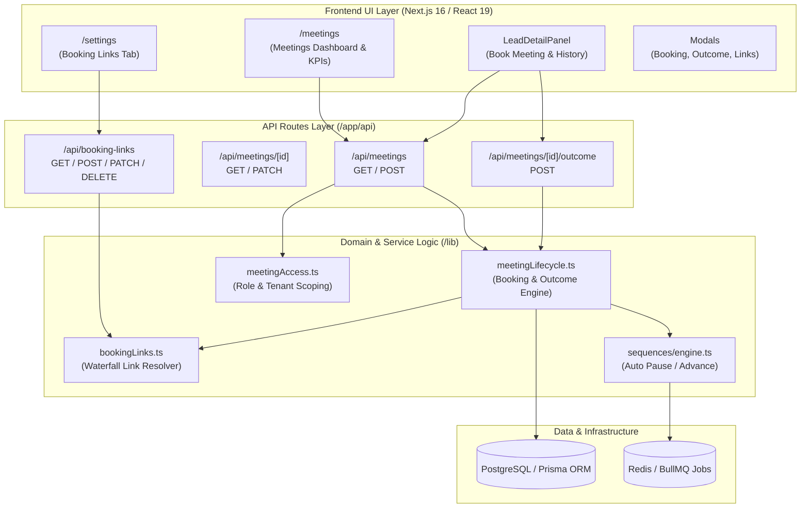
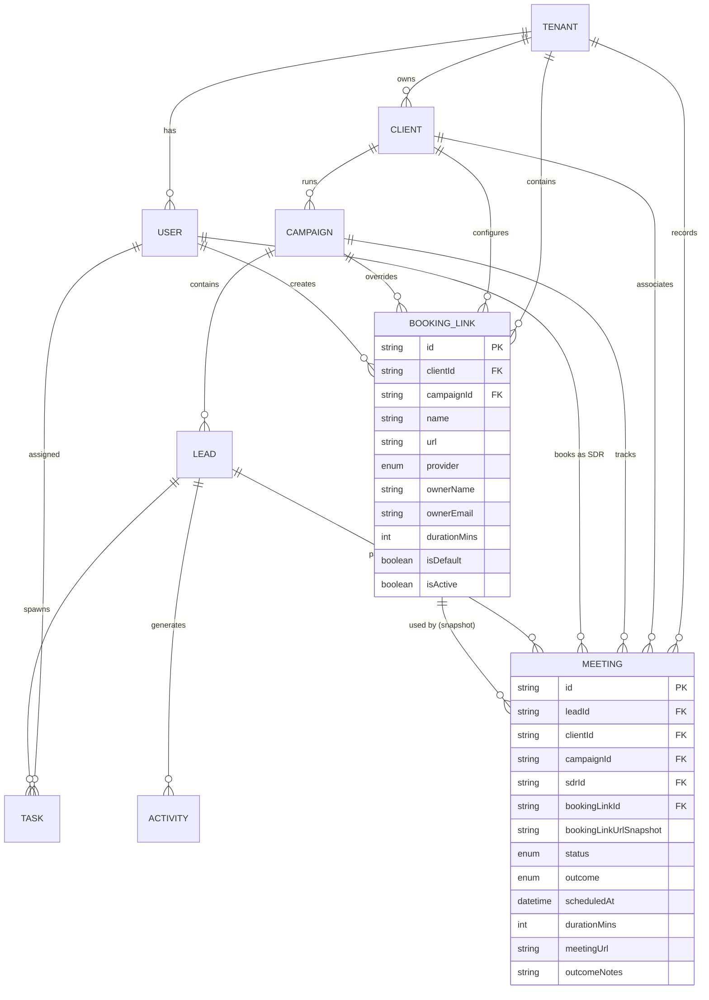
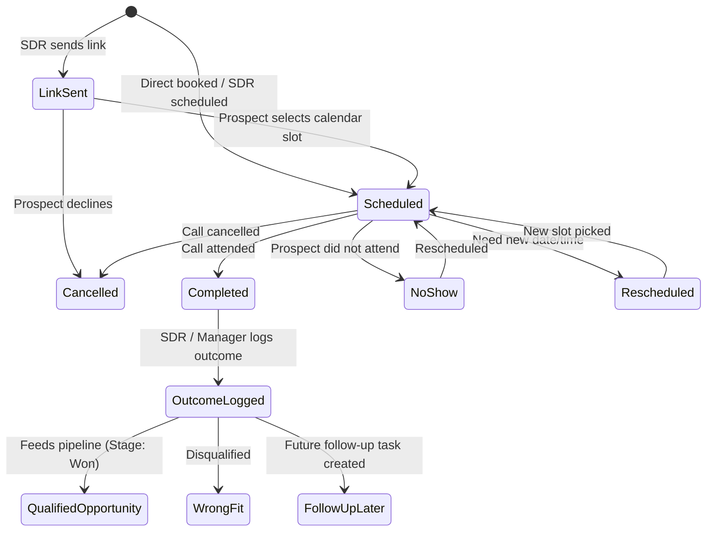
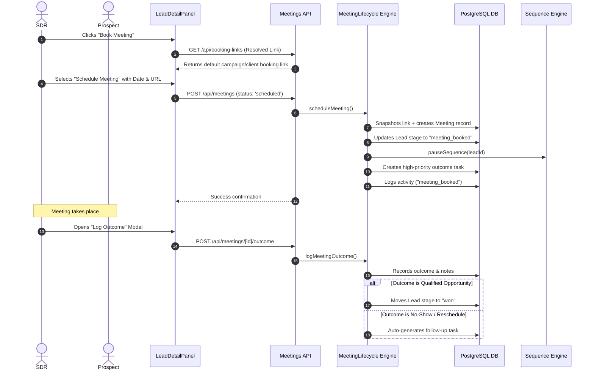

# Meeting Booking Module — System Architecture & Workflow Reference

> **Quick Reference**: This document contains full system architecture diagrams, data models, state machines, and operational flows for the Meeting Booking Module.

---

## 1. High-Level System Architecture

---

## 2. Entity-Relationship (ER) Diagram

---

## 3. Meeting Lifecycle State Machine

---

## 4. Operational SDR & Automation Sequence

---

## 5. File & Route Directory

| Component | Path | Description |
|---|---|---|
| **Dashboard** | `app/meetings/page.tsx` | Main dashboard with KPIs and table |
| **Settings** | `components/meetings/BookingLinkSettingsPanel.tsx` | Link manager in `app/settings` |
| **Lead Modal** | `components/meetings/MeetingBookingModal.tsx` | Scheduling & link copy popup |
| **Outcome Modal** | `components/meetings/MeetingOutcomeModal.tsx` | Post-call outcome logger |
| **Status Badge** | `components/meetings/MeetingStatusBadge.tsx` | Status pill badges |
| **Resolver** | `lib/meetings/bookingLinks.ts` | Waterfall link resolution |
| **Lifecycle** | `lib/meetings/meetingLifecycle.ts` | Transitions, tasks, sequence pause |
| **Access** | `lib/meetings/meetingAccess.ts` | Tenant/Role permission security |
| **Unit Tests** | `tests/meetings.test.ts` | Vitest automated test suite |
