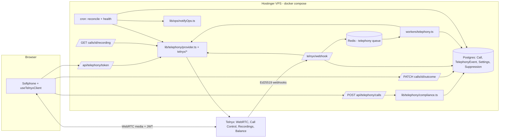
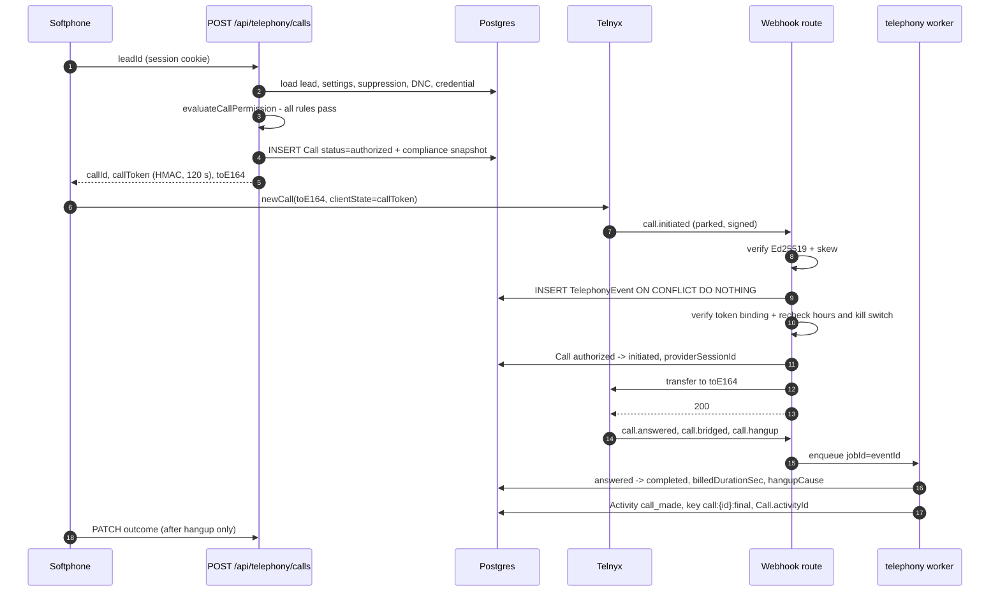
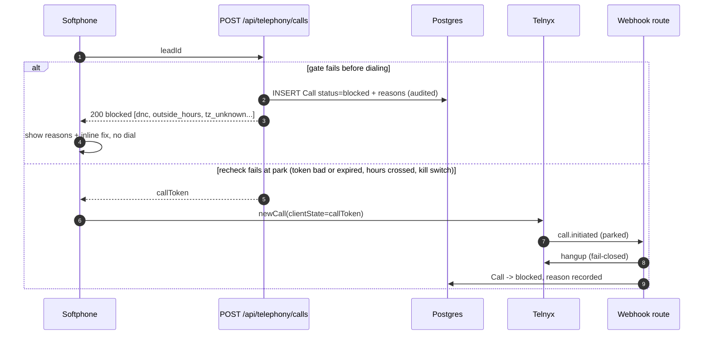
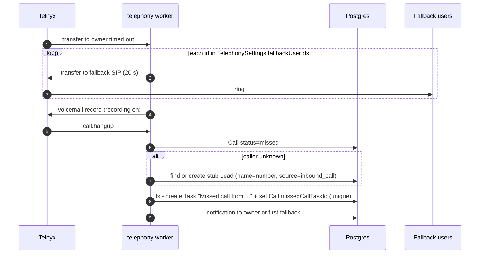
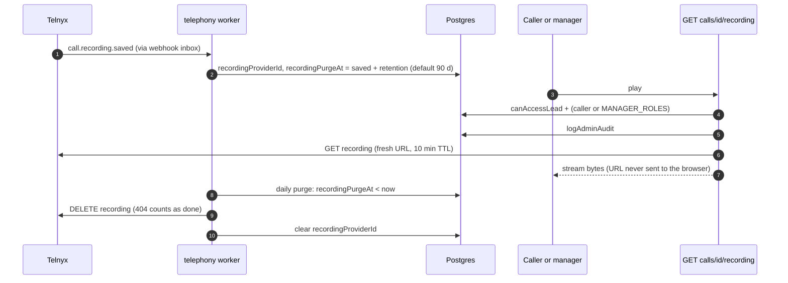

# Telnyx Dialer — Architecture

> **Revised 2026-10-08 (owner decisions, `TASKS.md`).** No inbound: diagrams (c) and (d) and
> `lib/telephony/inbound.ts` are not built, and `fallbackUserIds`/`inboundRingSecs` in `TelephonySettings`
> are unused. Vietnamese numbers are not dialled through Telnyx (the rep's own phone, logged by
> `PhoneCallPanel` and `POST /api/telephony/phone-calls`). Calling hours default to any time, so the 08:00-17:00 rule
> and the timezone lookup apply only when a manager narrows the hours. Recording has an optional spoken notice (default off).
> The Phase 0 spike became the live check in `TELNYX_SETUP.md` section 9. Operations: `RUNBOOK.md`.

Scope: outbound click-to-call (inbound dropped, see above) for ~34 SDRs (30+ concurrent calls) in
`CRM-4-Telestar-Final`, replacing `components/CallDialerModal.tsx` (sip.js + one SIP password served to
every browser by `app/api/dialer/config/route.ts`). Decision record: `ADR-001-park-and-authorize.md`.

## Components and boundaries

| Component | Location | Responsibility |
|---|---|---|
| Browser softphone | `components/dialer/useTelnyxClient.ts`, `Softphone.tsx` | `@telnyx/webrtc` client; one client per browser (BroadcastChannel lock); requests a call token before dialing; outcome form only after hangup. Audio goes browser ↔ Telnyx, never through the VPS. |
| Token route | `app/api/telephony/token/route.ts` | Lazily creates the user's Telnyx telephony credential (idempotent), mints a 24 h JWT, `Cache-Control: no-store`. No password reaches the browser. |
| Call route (gate) | `POST /api/telephony/calls` | Runs `lib/telephony/compliance.ts`; writes a `Call` (`authorized` or `blocked` + compliance snapshot); returns an HMAC call token (`lib/telephony/authToken.ts`). |
| Compliance service | `lib/telephony/compliance.ts` | Pure `evaluateCallPermission` + loader. Ordered rules: kill switch/dry-run → active credential → `canAccessLead` → valid E.164 → allowed country (never `VN`) → number type → `PhoneSuppression` → lead/contact `doNotCall` → calling hours in lead-local time (skipped when hours are "any time", the default). Exception ⇒ blocked (`gate_error`). |
| Provider adapter | `lib/telephony/provider.ts`, `telnyx/client.ts`, `telnyx/verify.ts`, `fake.ts`, `flags.ts` | Provider-neutral interface; Ed25519 verification (300 s skew); flags mirror `lib/emailSafety.ts` (disabled / dry-run / demo tenant ⇒ no dial). |
| Webhook route | `app/api/telephony/telnyx/webhook/route.ts` | Raw body → verify → `TelephonyEvent` insert (on conflict do nothing) → outbound `call.initiated` inline → everything else enqueued. Excluded in `proxy.ts`, declared public in route authorization. |
| Worker | `workers/telephony.ts` (registered in `workers/index.ts`), queue in `lib/bullmq/{types,queues,jobOptions}.ts` | Correlates events, forward-only status, finalize, Activity write, recording storage, daily purge. ~~Inbound routing (`lib/telephony/inbound.ts`)~~ not built. |
| Cron | `app/api/cron/telephony-reconcile`, `app/api/cron/telephony-health` (5 min, `CRON_SECRET`) | Reconcile: replay unprocessed events, cancel stale `authorized`, finalize stuck calls against Telnyx. Health (`lib/telephony/health.ts`): balance, failure rate, webhook silence, event backlog, concurrency, alerted via `lib/ops/notifyOps.ts` with a per-condition cooldown; platform-wide, scheduler secret only. |
| Manager settings | `app/settings/telephony/page.tsx`, `components/settings/telephony/*`, `app/api/telephony/settings/**`, `lib/telephony/settings*.ts` | Managers (`MANAGER_ROLES`, no API keys): enabled / dry-run / kill switch, hours and weekdays, allowed countries, recording options, caller ID numbers (`TelephonyNumber`, per-country and overall default read by `lib/telephony/callerId.ts`), softphone logins and revoke, server switches read-only. Every change audited (`admin.telephony.*`) with before and after. |
| Postgres | migration `telephony_core` | `Call`, `TelephonyCredential`, `TelephonyNumber`, `TelephonyEvent`, `TelephonySettings`, `PhoneSuppression`, `Lead`/`Contact.doNotCall*`; tenant RLS via `supabase/rls.sql`. |
| Telnyx | external | Credential connection (outbound, call parking on), Call Control app (created for the env check; no inbound number), outbound voice profile (country whitelist, concurrency and daily spend caps), recordings. |

## Trust boundaries

1. **Browser → API.** Untrusted; session cookie; tenant always from the session. The browser cannot
   mark a call as successful — `PATCH /api/telephony/calls/[id]/outcome` only labels the rep's own call
   once it is final.
2. **Browser → Telnyx.** The JWT is scoped to one user's credential, and a credential alone can dial
   anything — which is why the gate is enforced server-side at park time.
3. **Telnyx → webhook.** Public internet; accepted only with a valid Ed25519 signature
   (`TELNYX_PUBLIC_KEY`) and a timestamp within 300 s, otherwise 401.
4. **Server → Telnyx API.** `TELNYX_API_KEY`, server-only, declared in `lib/env-contract.ts`.
5. **Call token.** HMAC (`TELEPHONY_AUTH_SECRET`) over `{callId, tenantId, userId, toE164, exp}`, 120 s —
   binds what the server authorized to what Telnyx parks.

## Data flow

`Call` rows are the single source of truth; only signed webhooks move their status; only the worker writes
the `Activity` (`call_made`). Recordings stay at Telnyx — we store the id and stream playback through our
route.

## Component diagram



## (a) Outbound happy path — park and authorize



## (b) Outbound blocked



## (c) Inbound to the lead's owner — not built (superseded 2026-10-08: no inbound)

```mermaid
sequenceDiagram
  autonumber
  participant C as Caller
  participant T as Telnyx Call Control
  participant WH as Webhook route
  participant W as telephony worker
  participant DB as Postgres
  participant O as Owner softphone
  C->>T: dials a TelephonyNumber
  T->>WH: call.initiated (inbound)
  WH->>W: enqueue (high priority)
  W->>DB: number -> tenant; normalizedPhone -> Lead, then Contact -> owner
  W->>DB: INSERT Call inbound status=initiated
  W->>T: answer + transfer to owner SIP (inboundRingSecs=20)
  W->>DB: status=ringing
  T->>O: incoming call (WebRTC)
  O->>T: accept
  T->>WH: call.bridged, later call.hangup
  W->>DB: answered -> completed, Activity once
```

## (d) Inbound missed → fallback → missed-call task — not built (superseded 2026-10-08: no inbound)



## (e) Recording saved → playback → purge



Assumptions the live check (`TELNYX_SETUP.md` section 9, replacing the Phase 0 spike) must confirm: the token arrives on `call.initiated` (the SDK exposes
`clientState` and `X-` custom headers on `newCall`); `ringing` is inferred from the transfer leg (Telnyx
has no explicit ringing event); inbound `call.initiated` through the queue is fast enough to answer — if
not, it moves inline like outbound.
