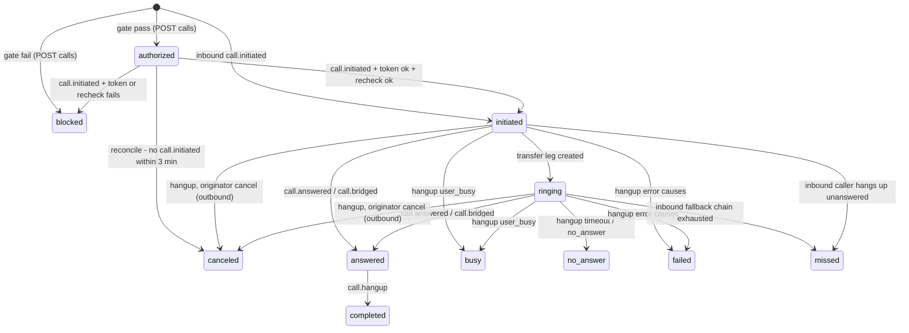

# Telnyx Dialer — System Design

## Call status state machine

Status only moves forward. Terminal: `blocked`, `completed`, `no_answer`, `busy`, `failed`, `missed`,
`canceled`. After a row is terminal the worker never changes its status; later events only fill empty
fields (duration, recording, hangup cause).

### Event → effect

| Telnyx event | Effect |
|---|---|
| `call.initiated` outbound (parked) | Inline: `authorized → initiated` + transfer, or `→ blocked` + hangup. Stores `providerSessionId`. |
| `call.initiated` inbound | Creates the `Call` (`initiated`), starts routing. |
| transfer leg created | `→ ringing` (no explicit Telnyx ringing event; spike confirms). |
| `call.answered` / `call.bridged` | `→ answered`, sets `answeredAt`. |
| `call.hangup` | `answered → completed`. Before answer, by `hangup_cause`: `user_busy` → `busy`; `timeout`, `no_answer` → `no_answer`; `originator_cancel` or our own `normal_clearing` → `canceled` (outbound) / `missed` (inbound); `call_rejected`, `unallocated_number`, `normal_temporary_failure`, `destination_out_of_order`, unknown → `failed`. Sets `hangupCause`, `endedAt`, `billedDurationSec`. |
| `call.recording.saved` | No status change; sets `recordingProviderId`, `recordingPurgeAt`. |
| `call.machine.detection.ended` | No status change; outcome hint `voicemail` when the result is `machine`. |

**Out of order.** The hangup is finalized by a job delayed 5 s (`jobId = final:{callId}`) that reads every
`TelephonyEvent` for the session: if any answered/bridged event exists the call ends `completed`,
whatever order the events arrived in. The reconcile cron is the backstop.

## Idempotency keys

| Key | Guards against |
|---|---|
| `TelephonyEvent.providerEventId @unique` (insert on conflict do nothing) | Telnyx delivering a webhook more than once |
| BullMQ `jobId = providerEventId` | Enqueueing the same event twice (incl. reconcile replay) |
| `Call @@unique([provider, providerSessionId])` | Two rows for one provider call |
| `Activity.idempotencyKey = call:{id}:final` + `Call.activityId @unique` | More than one `call_made` per call (inflated metrics) |
| `Call.missedCallTaskId @unique`, set in the same transaction as the Task | Duplicate missed-call tasks |
| Stub-lead lookup on `[tenantId, normalizedPhone]` before insert | A new lead on every repeat unknown call |
| `TelephonyCredential [tenantId, userId] @unique` | Several credentials from concurrent token requests |
| `PhoneSuppression [tenantId, e164] @unique` | Duplicate do-not-call entries |
| Purge treats Telnyx 404 as success | A purge retrying forever |

## Failure modes

| Failure | Detection | System behaviour | Operator action |
|---|---|---|---|
| Telnyx down/degraded | Token/API 5xx; failure rate >20% / 15 min (≥10 calls) | Softphone shows "provider unavailable"; `authorized` rows cancelled by reconcile after 3 min | Check Telnyx status; kill switch if it lasts; manual logging still works |
| Webhook delayed | Webhook silence in working hours; stale `initiated`/`ringing` | A parked call nobody authorizes is never connected (fail-closed); late events still apply forward-only; reconcile finalizes from the Telnyx API | Check VPS/proxy reachability and the failover URL |
| Webhook duplicated | Unique `providerEventId` conflict | Ignored, answered 200 | None |
| Webhook out of order | Event ranks below current status | Ignored (forward-only); delayed finalize recomputes from the inbox | None |
| Worker down | Event backlog >50 | Events already in `TelephonyEvent`; outbound connect still works (inline); Activities and inbound routing delayed | Restart the `worker` container; reconcile replays |
| DB down | Webhook insert fails → 5xx | Telnyx retries, then the failover URL; `call.initiated` cannot be authorized → not connected | Restore Postgres (`docs/BACKUP_RESTORE_RUNBOOK.md`); reconcile catches up |
| JWT expiring | `telnyx.warning` 34001 | `useTelnyxClient` refreshes; established media continues | None |
| Call token expired before park | `exp` check in the webhook | Hangup, `blocked (token_expired)`; softphone offers retry (re-runs the gate) | None |
| Tab closed mid-call | Telnyx `call.hangup` | Finalized from the webhook; Activity still written; outcome can be added within 24 h | None |
| Rep network drop | SDK reconnect; hangup `normal_temporary_failure` | Ends `completed` (answered) or `failed`; softphone shows reconnecting | Check rep connectivity if repeated |
| Balance exhausted | `GET /v2/balance` below `TELNYX_BALANCE_ALERT_USD`; calls rejected | Calls `failed`; alert via `notifyOps` | Auto-recharge / top up; check daily spend cap |
| Concurrency limit hit | Active calls ≥80% of the limit; hangup `call_rejected` | Calls `failed` with cause; softphone says "line limit reached" | Raise the Telnyx limit; roll out in batches |

## Capacity (30+ concurrent calls)

- Media never touches the VPS; it carries signaling only.
- ~6–10 events per call; 40 concurrent calls of ~3 min ≈ 2–4 webhooks/s at peak (estimate) — light for one
  Next.js container.
- Inline `call.initiated`: one event insert, one `Call` read by primary key, a settings read, one Telnyx
  command — token, hours and kill switch only, not the whole gate.
- `workers/telephony.ts` at concurrency 5 (like the email and sequence workers), inside the current pool.
- The binding limit is Telnyx's concurrency (default 2/10 → raise to ≥40): go/no-go for rollout; alert at 80%.

## Latency budget: park → connect < 1.5 s (p95, estimates)

| Step | Budget |
|---|---|
| Telnyx parks and dispatches `call.initiated` | 300 ms |
| Telnyx → Hostinger VPS | 150 ms |
| Handler: verify, insert, load Call, token + hours (p95) | 100 ms |
| Transfer command round trip | 400 ms |
| Telnyx starts the outbound leg | 300 ms |
| **Total / headroom** | **1,250 ms / 250 ms** |

The Telnyx command has a 1 s timeout; on timeout we send a hangup, and if that fails Telnyx's own park
timeout drops the call, so it is never connected unauthorized. The spike measures real p50/p95 over ≥20
calls to Vietnam.
